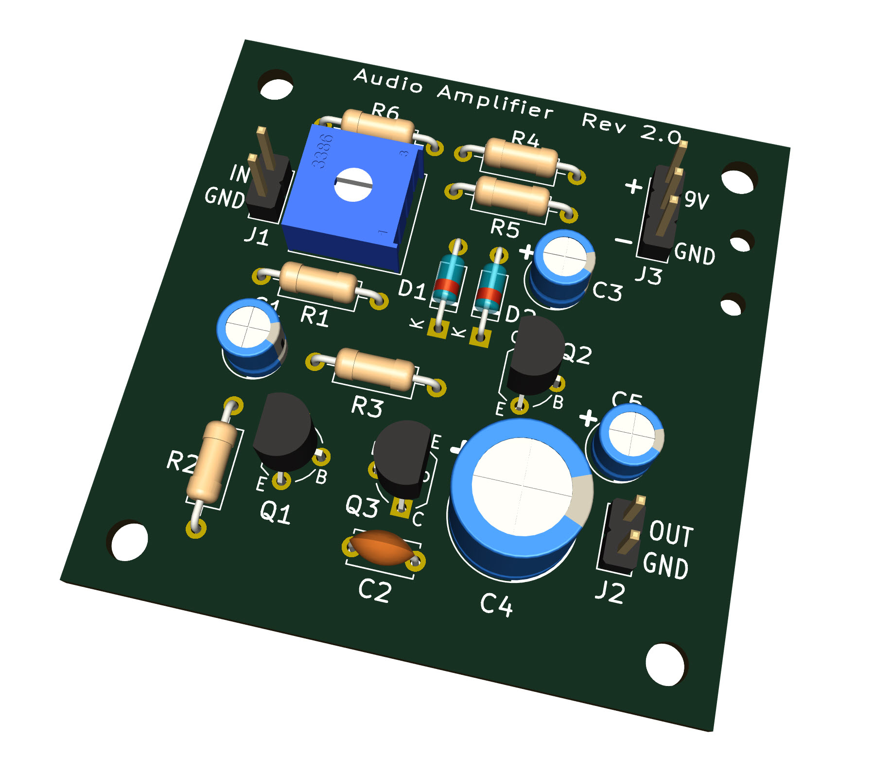
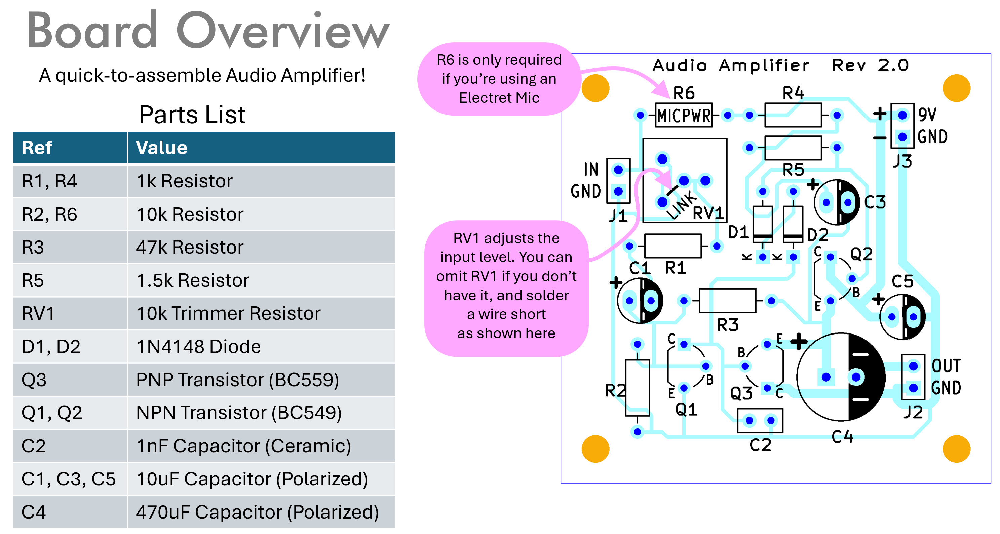
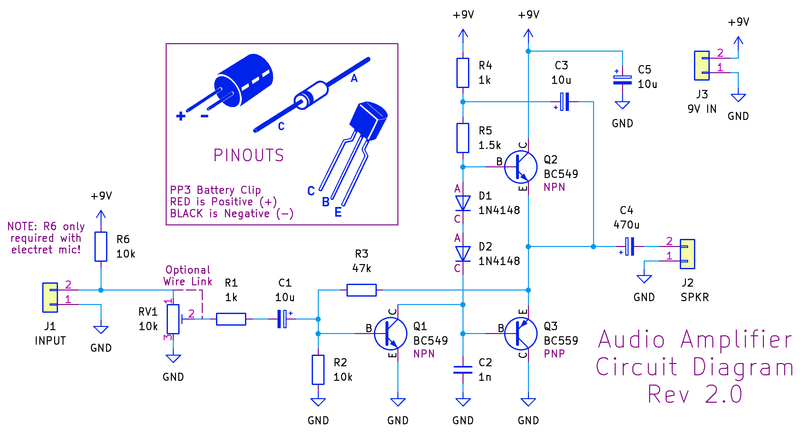
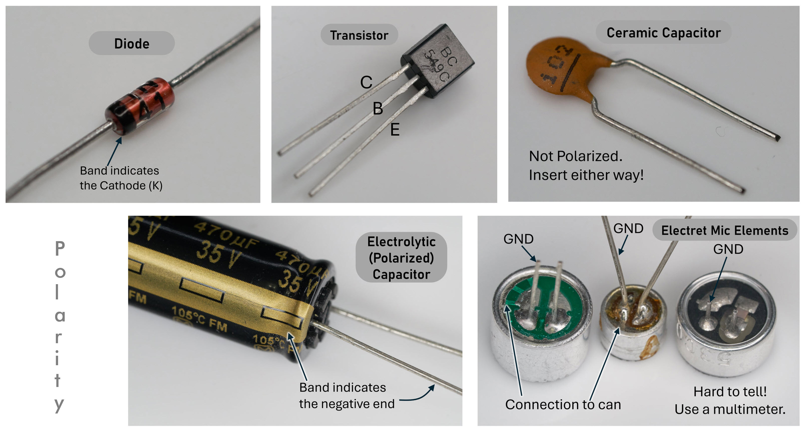

# Audio Amplifier

This repository contains information to build an audio amplifier:

To build it, download the audio-amp-gerber-files-rev2.zip file contained within this repository, and upload it to any printed circuit board (PCB) manufacturer. It will cost around $2 plus shipping, for five or so boards.

All build details are contained in the Audio Amplifier PDF Guide [(click here to download the PDF guide to your PC)](https://raw.githubusercontent.com/shabaz123/audio_amplifier/main/audio-amp-project.pdf)

## Tips

**Electret Microphone**

The mic needs to be soldered with the correct orientation. Observe the markings or use a multimeter to confirm which pin is connected to the metal can of the mic, which will be the GND connection

If you’re not using an electret mic, then you don’t need resistor R6 (R6 provides power to the mic)

**Audio Level**

If the audio input level is too high, the output will distort. Adjust RV1 to control the level. If you don’t have RV1, then you need to solder a wire link to as shown on the board markings.

**Component Orientation is Important**

Resistors, and the ceramic capacitor, can go in either way

The polarized capacitors (electrolytic capacitors) have a band marking the negative side

The diodes have a band that indicates the Cathode (K) end

Follow the graphic outlines marked on the board accordingly, for all components

It isn’t essential to observe speaker polarity

**Careful not to short the battery!**

Use the holes on the board to provide a bit of strain relief and separation for the battery connections and any other wires

## For Your Reference: Circuit Diagram

## Some Example Component Polarity

## For Your Reference: How Does It Work?

**Push-Pull Output Transistors Q2 and Q3**

The two totem-pole transistors Q2 and Q3 operate in a push-pull arrangement, to drive the output high or low; these two transistors provide the current gain for the amplifier.

**Output Transistors Biasing**

If the input changes slightly but the transistors do not conduct, then that is distortion! The solution is to always have the transistors conducting slightly

The two diodes ensure there’s always 1.2V of difference (i.e. two ‘diode drops’) between the base voltages for both output transistors, and this is used to ensure that both transistors are always slightly conducting.

For instance, if the output happens to be at 4V, then the top transistor base voltage has to be around 4.6V (because when conducting, a transistor has 0.6V difference between base and emitter), and that means that the lower transistor voltage has to be about 3.4V (two diode drops less than 4.6V); that ensures that the lower transistor is conducting too.

Capacitor C3 is interesting; it is used to provide extra bias to the top transistor so that the output voltage can swing higher when needed; the way it works is that if you assume C3 has charged to some voltage level, then when the output swings high, the left side of C3 has to swing high too, and that turns on the transistor harder. C3 is known as a bootstrap capacitor.
The lower transistor doesn’t have such a bootstrap capacitor; it doesn’t need the extra help in turning on, since transistor Q1 can relatively easily pull the base of Q3 low.

**Voltage Gain**

The purpose of transistor Q1 is to perform as a common-emitter amplifier, providing voltage gain for the overall amplifier circuit.

**Overall Negative Feedback**

Resistor R7 forms the control loop for this combined circuit, in order to ensure that the output remains an undistorted representation of the input (but amplified).
